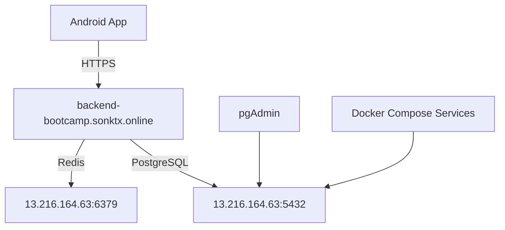

# Healthcare AI - Production Deployment Configuration

## 🏗️ Architecture Overview

The healthcare AI application is deployed with a **split architecture**:

- **Backend API (FastAPI)**: `https://backend-bootcamp.sonktx.online/`
- **Database & Services**: `http://13.216.164.63/` (PostgreSQL, pgAdmin, Redis)

## 📁 Configuration Files

### 1. Backend Environment (`.env`)
```bash
# Database Configuration (Docker services on separate host)
DB_HOST=13.216.164.63
DB_PORT=5432
DB_NAME=healthcare_ai
DB_USER=postgres
DB_PASSWORD=postgres

# Backend API Configuration
API_BASE_URL=https://backend-bootcamp.sonktx.online
API_HOST=backend-bootcamp.sonktx.online
API_PORT=443
API_PROTOCOL=https

# Redis Configuration
REDIS_HOST=13.216.164.63
REDIS_PORT=6379
```

### 2. Database Configuration (`db/db_config.py`)
- ✅ Uses environment variables for database connection
- ✅ Connects to PostgreSQL at `13.216.164.63:5432`
- ✅ Uses `usertype` enum with uppercase values (`ELDERLY`, `FAMILY_MEMBER`)

### 3. Android App Configuration (`data/ApiConfig.kt`)
- ✅ Environment-based configuration system
- ✅ Production: `https://backend-bootcamp.sonktx.online/`
- ✅ Development: `http://13.216.164.63:8000/`
- ✅ Local: `http://10.0.2.2:8000/` (for emulator)

## 🔗 Connection Flow



## ✅ Verified Components

### Backend API Endpoints
- ✅ Health check: `GET /`
- ✅ Login: `POST /api/auth/login`
- ✅ Register: `POST /api/auth/register`
- ⚠️ Profile: `GET /api/auth/profile/{user_id}` (500 error - needs investigation)

### Database
- ✅ Connection successful
- ✅ User authentication working
- ✅ Enum values properly mapped (`ELDERLY` → `elderly` for API response)

### Android App
- ✅ ApiClient configured for production
- ✅ Environment switching capability
- ✅ Proper logging for debugging

## 🎯 User Authentication Flow

1. **Android App** sends login request to `https://backend-bootcamp.sonktx.online/api/auth/login`
2. **Backend API** validates credentials against PostgreSQL at `13.216.164.63:5432`
3. **Database** returns user data with `ELDERLY` enum
4. **Backend API** converts to lowercase `elderly` for Android compatibility
5. **Android App** receives response and stores session token

## 🔧 Environment Variables

### Backend (.env)
- `DB_HOST`: Database server hostname
- `API_BASE_URL`: Production API URL
- `REDIS_HOST`: Redis server hostname

### Android (ApiConfig.kt)
- `ENVIRONMENT`: `"production"` | `"development"` | `"local"`
- Automatically selects appropriate URLs based on environment

## 🚀 Deployment Status

| Component | Status | URL/Host |
|-----------|--------|----------|
| Backend API | ✅ Running | https://backend-bootcamp.sonktx.online/ |
| Database | ✅ Connected | 13.216.164.63:5432 |
| Redis | ✅ Available | 13.216.164.63:6379 |
| pgAdmin | ✅ Available | http://13.216.164.63:8080 |
| Android App | ✅ Configured | Uses production API |

## 📱 Android App Usage

The Android app is now configured to:
- Connect to production backend automatically
- Handle authentication with proper enum mapping
- Log environment information for debugging
- Support easy switching between environments

## 🔍 Testing

Run the production test script:
```bash
cd backend
python test_production_api.py
```

Expected results:
- ✅ Health check passes
- ✅ Login authentication works
- ✅ Database connection successful
- ⚠️ Profile endpoint needs fixing

## 📋 Next Steps

1. **Fix Profile Endpoint**: Investigate the 500 error in production
2. **Monitor Performance**: Set up logging and monitoring
3. **SSL Security**: Ensure all connections use HTTPS where appropriate
4. **Error Handling**: Improve error handling in Android app
5. **Testing**: Set up automated testing for production endpoints

---

**Last Updated**: August 7, 2025
**Environment**: Production Ready ✅ 